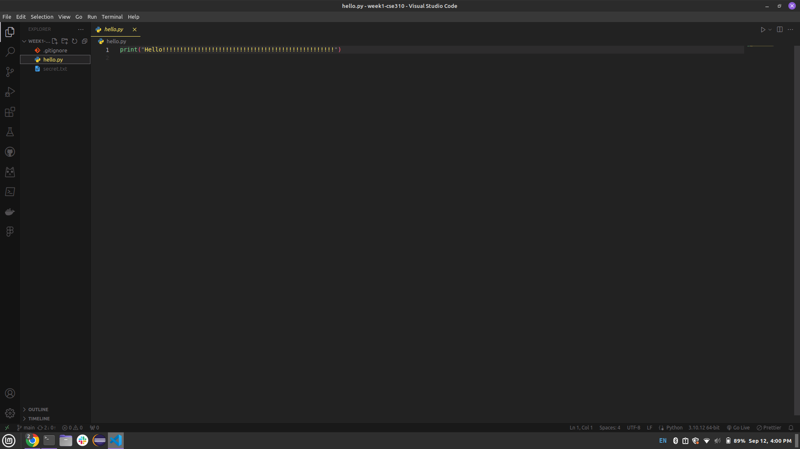

# Overview

This is the classic Hello World application.

I wanted to create a Hello World app using Python, vscode, and git.

[Software Demo Video](https://youtu.be/Yhkl5d6pyFI)

# Development Environment

Visual Studio Code

Pyhton 3.10.12

Git

# Useful Websites

- [Git Website](https://git-scm.com/)
